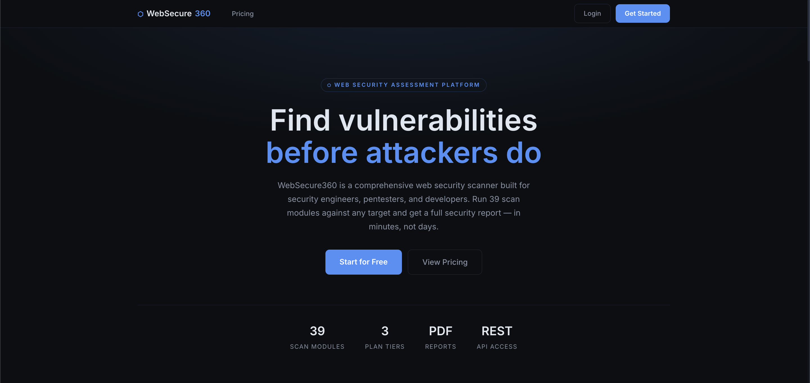
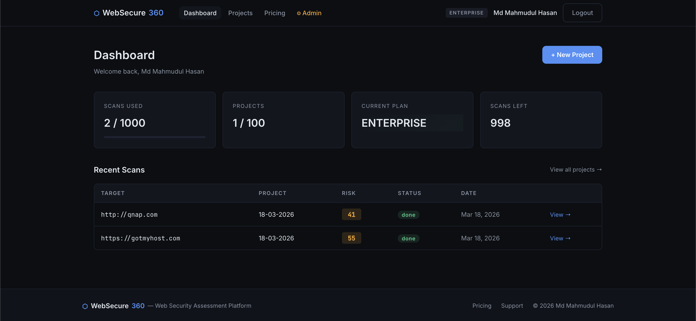
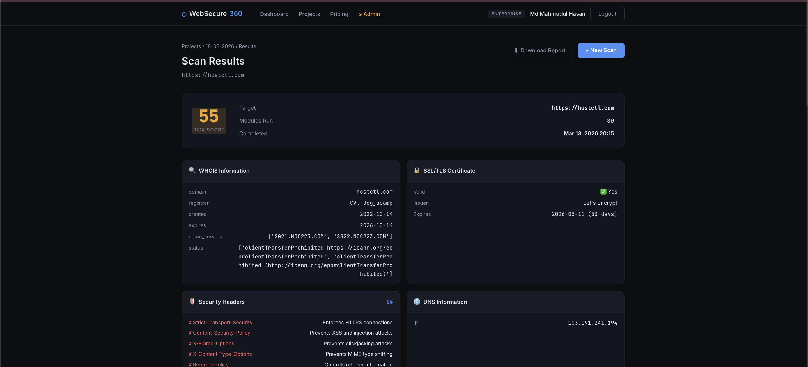
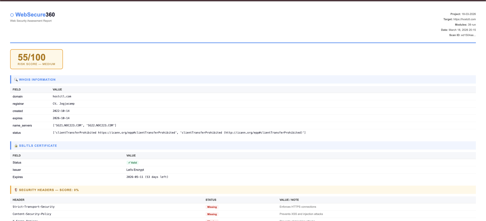

<div align="center">

# ⬡ WebSecure360

**Web Security Assessment Platform**

[](https://python.org)
[](https://flask.palletsprojects.com)
[](LICENSE)
[](https://github.com/mahmudul0x1)

</div>

---

## What is WebSecure360?

WebSecure360 is a web-based security assessment platform. Enter a target URL, select scan modules, and get a structured security report — all from your browser.

Built with Flask. Runs locally or on any VPS. Includes user accounts, project management, 3-tier subscription model, REST API, and PDF reports.

---

## Quick Start

```bash
git clone https://github.com/mahmudul0x1/websecure360
cd websecure360
pip install -r requirements.txt
python run.py
```

Open **http://localhost:5000**

Admin login is printed in the terminal on first run.

---

## Requirements

**Python 3.8+** — https://python.org

**wkhtmltopdf** — required for PDF report download

| OS | Install Command |
|---|---|
| macOS | `brew install wkhtmltopdf` |
| Ubuntu / Debian | `sudo apt install wkhtmltopdf` |
| Windows | Download from https://wkhtmltopdf.org/downloads.html |

> If you don't have Homebrew on Mac: `/bin/bash -c "$(curl -fsSL https://raw.githubusercontent.com/Homebrew/install/HEAD/install.sh)"`

Verify installation:
```bash
wkhtmltopdf --version
```

---

## Scan Modules

| Module | Free | Pro | Enterprise |
|---|:---:|:---:|:---:|
| WHOIS Lookup | ✓ | ✓ | ✓ |
| SSL/TLS Certificate | ✓ | ✓ | ✓ |
| Security Headers | ✓ | ✓ | ✓ |
| DNS Information | ✓ | ✓ | ✓ |
| Subdomain Enumeration | — | ✓ | ✓ |
| Port Scanner | — | ✓ | ✓ |
| URL Fuzzer | — | ✓ | ✓ |
| XSS Detection | — | ✓ | ✓ |
| SQL Injection Check | — | ✓ | ✓ |
| Technology Fingerprinting | — | ✓ | ✓ |

---

## Plans

| | Free | Pro | Enterprise |
|---|---|---|---|
| Price | $0 | $15/mo | $49/mo |
| Scans/month | 5 | 100 | 1,000 |
| Projects | 2 | 20 | 100 |
| PDF Reports | ✗ | ✓ | ✓ |
| REST API | ✗ | ✓ | ✓ |
| Priority Support | ✗ | ✗ | ✓ |

---

## REST API

Pro and Enterprise users can access scan data via API:

```bash
# Get account info
curl -H "Authorization: Bearer YOUR_API_KEY" http://localhost:5000/api/v1/me

# List projects
curl -H "Authorization: Bearer YOUR_API_KEY" http://localhost:5000/api/v1/projects

# Get scan results
curl -H "Authorization: Bearer YOUR_API_KEY" http://localhost:5000/api/v1/scans/SCAN_ID
```

---

## Stack

- **Backend** — Python, Flask, SQLAlchemy, Flask-Login
- **Database** — SQLite (local) / PostgreSQL (production)
- **Payments** — Stripe (subscriptions)
- **PDF** — wkhtmltopdf via pdfkit
- **Frontend** — Vanilla HTML/CSS/JS, no frameworks

---






---

## Legal

For authorized security testing only. Do not scan targets you do not own or have explicit written permission to test.

---

## Author

**Md Mahmudul Hasan** — Security Engineer & Red Teamer

- GitHub: [@mahmudul0x1](https://github.com/mahmudul0x1)
- LinkedIn: [mahmudul-hasan](https://www.linkedin.com/in/mahmudul-hasan-816a471a4)
- Email: mahmudul24x7@gmail.com
